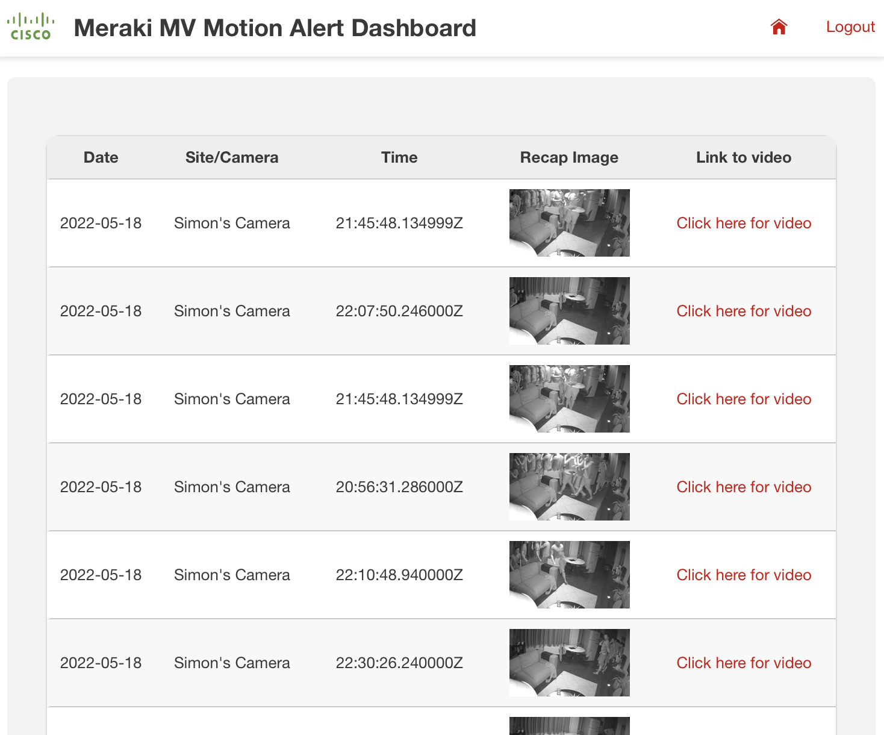
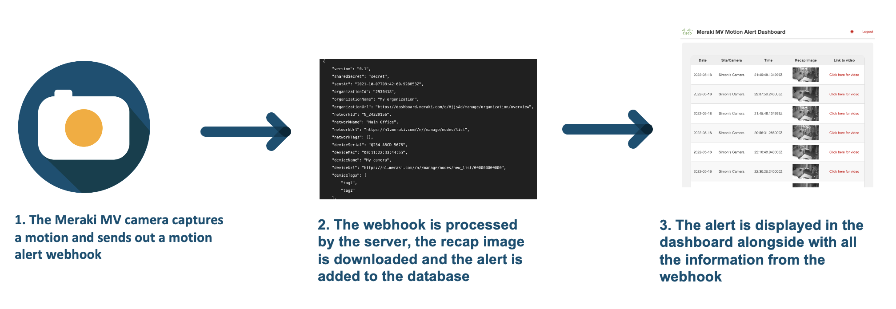
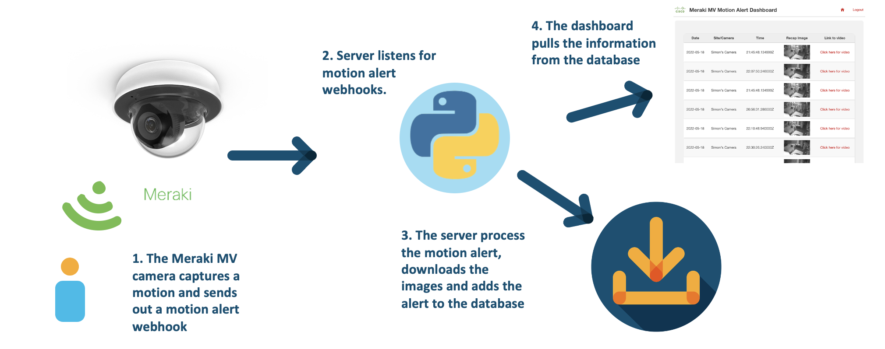

# GVE DevNet Meraki MV Motion Alert Dashboard
The Meraki MV cameras are cloud-managed, smart cameras with rich API functionality. One of these functionalities is to enable motion alerts on the cameras through the Meraki dashboard. While all the information and data can be accessed through the Meraki dashboard, some customers would like to embed the motion alert information in their own applications. The motion alerts are delivered through email and webhooks. In this prototype, we leverage the information from the motion alert webhook and we create a custom dashboard using the information provided in the webhook. 

The dashboard captures the date, time, location/name of the camera, a recap image and a link to the footage accessible through the Meraki dashboard. The recap image is a composite image of the motion and the link is provided with a timestamp, which will allow us to start the video at the start of the motion. For an example of the dashboard, see the image below. 



The prototype is developed using the Flask framework. In the back-end, we have a dedicated webhook listener and once a webhook comes in, we process the information, download the recap image and add the alert to the database. 





## Contacts
* Simon Fang (sifang@cisco.com)

## Solution Components
* Python
* Flask
* Meraki MV

## How to configure a motion alert on a Meraki MV camera

The Meraki MV can be triggered when an area in the MV's field of view is changed. An alert will be generated and can be sent via email or webhook. You can configure a motion alert as follows:

1. Navigate to **Cameras > Monitor > Cameras**
2. Select the desired Meraki MV camera
3. Navigate to **Settings > Motion Alerts** to configure alerts for this specific Meraki MV camera

On this page, you can specify a few configurations. For the prototype, we used the following settings:

* When should this camera send alerts?
    * Always
* Include Motion Recap Image
    * Enabled
* Alert only on People Events (Beta)
    * Enabled
* Areas of Interest
    * Enabled
    * Select the area of interest in the area below

4. After changing the settings, don't forget to click the **save** button

> For more information about motion alert settings, please click [here](https://documentation.meraki.com/MV/Advanced_Configuration/Motion_Alerts)

## How to configure the alert settings and register your webhook HTTP server in the Meraki Dashboard
Whenever an event occurs, the Meraki dashboard can send out an email alert or webhook alert. An example of such an alert is the motion alert that we configured in the previous section. In this section, it will be explained how we can configure the alert settings and register the webhook HTTP server. First let's register our webhook:

1. Navigate to **Network-wide > Configure > Alerts**
2. Under **Webhooks**, add the name of the HTTP server. 
3. Add the url of the server and endpoint, i.e. `https://{insert_url}/webhook_listener`. For example, if your URL is `10.10.10.10`, then you will have to add the following URL: `https://10.10.10.10/webhook_listener`.
Please note that it must be a **public URL**. 
> In case you are testing locally, then it is suggested to use `ngrok` to expose a port to the internet. For more instructions, please see the next section.

4. Optional: add a shared secret
5. Under `payload template`, selected **Meraki (included)**. 
6. Optional: select `Send test webhook` in order to test whether your app receives the webhook
7. After having added your webhook http server, we navigate to **Alert Settings** at the top of the page
8. Add the name of the webhook http server to the **Default recipients**
9. Click save in order to save your configurations

> For more information about alerts and notification settings, please click [here](https://documentation.meraki.com/General_Administration/Cross-Platform_Content/Alerts_and_Notifications)

## How to download NGROK
If you are testing locally, then you need to have a public ip that tunnels back to your local machine. There are many solutions that can provide this service. In this prototype, we have chosen **ngrok**. If you have not downloaded it yet, then follow the following instructions:

1. Install ngrok via Homebrew:

```
    $ brew install ngrok/ngrok/ngrok
```

or download the ZIP file via [their website](https://ngrok.com/download) and then unzip ngrok from the terminal:

```
    $ sudo unzip ~/Downloads/ngrok-stable-darwin-amd64.zip -d /usr/local/bin
```

2. Add authtoken (sign up if you don't have one):

```
    $ ngrok authtoken <token>
```

> For more information about the download instruction of ngrok, then head over to [their website](https://ngrok.com/download) 

## Installation/Configuration

The following commands are executed in the terminal.

1. Create and activate a virtual environment for the project:
   
        #WINDOWS:
        $ py -3 -m venv [add_name_of_virtual_environment_here] 
        $ [add_name_of_virtual_environment_here]/Scripts/activate.bat 
        #MAC:
        $ python3 -m venv [add_name_of_virtual_environment_here] 
        $ source [add_name_of_virtual_environment_here]/bin/activate
        
> For more information about virtual environments, please click [here](https://docs.python.org/3/tutorial/venv.html)

2. Access the created virtual environment folder

        $ cd [add_name_of_virtual_environment_here]

3. Clone this repository

        $ git clone [add_link_to_repository_here]

4. Access the folder `gve_devnet_meraki_mv_alert_dashboard`

        $ cd gve_devnet_meraki_mv_alert_dashboard

5. Install the dependencies:

        $ pip install -r requirements.txt

6. Open the `config.py` file and add the name of the database.

    ```python
    SQL_DB_NAME = "insert_name_of_db" # e.g. sqlite:///example.db
    ```
7. Configure your motion alert settings (for instructions, see section above)

8. Optional: if testing locally, start your ngrok session (for instructions, see section above) with the following command: 

```
$ ngrok http http://127.0.0.1:5001
```
9. Configure your alert settings and register your webhook server (for instructions, see section above)

## Usage
Now it is time to launch the application! Simply type in the following command in your terminal:

    $ python app.py

Then, head over to the URL that is displayed in the terminal output. You will be taken to the Meraki MV Motion Alert Dashboard. 

In the meantime, your flask app will be listening for incoming webhook motion alerts. 


# Screenshots


### LICENSE

Provided under Cisco Sample Code License, for details see [LICENSE](LICENSE.md)

### CODE_OF_CONDUCT

Our code of conduct is available [here](CODE_OF_CONDUCT.md)

### CONTRIBUTING

See our contributing guidelines [here](CONTRIBUTING.md)

#### DISCLAIMER:
<b>Please note:</b> This script is meant for demo purposes only. All tools/ scripts in this repo are released for use "AS IS" without any warranties of any kind, including, but not limited to their installation, use, or performance. Any use of these scripts and tools is at your own risk. There is no guarantee that they have been through thorough testing in a comparable environment and we are not responsible for any damage or data loss incurred with their use.
You are responsible for reviewing and testing any scripts you run thoroughly before use in any non-testing environment.